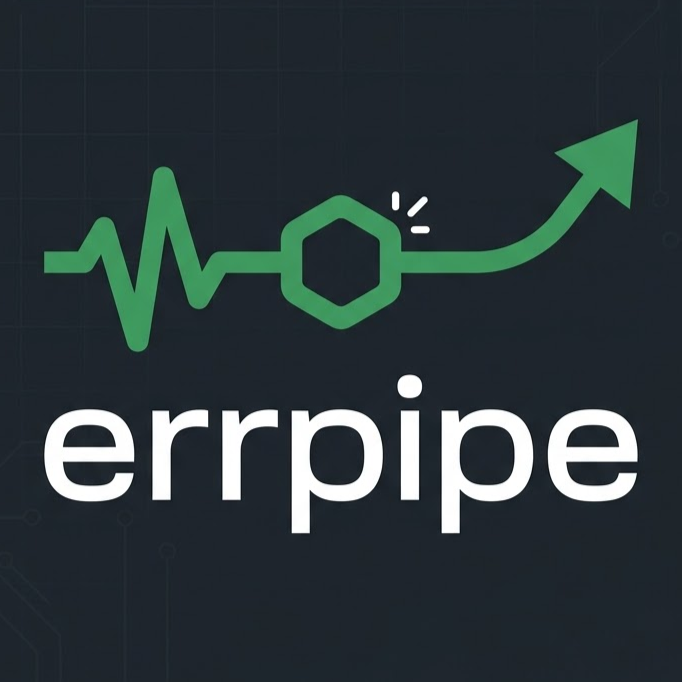
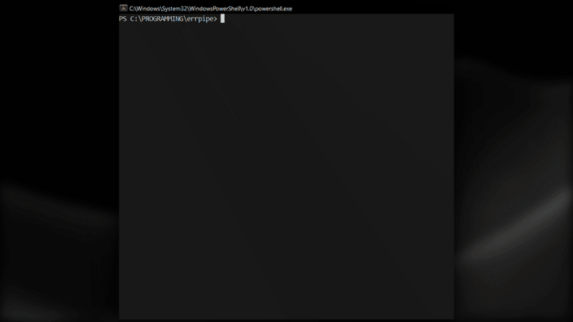

# errpipe

<div align="center">


<br>


**Stop copy/pasting errors. Let your terminal talk to AI.**

[Install](#install) · [Usage](#usage) · [How it Works](#how-it-works) · [Contributing](#contributing)

<br>

</div>

---

## What is this

`errpipe` is an interactive shell wrapper built in Go that monitors your commands. When a command fails, it automatically captures the error output and sends it to your preferred LLM for immediate analysis and fixes.

Instead of switching to your browser manually, `errpipe` brings the fix to you, either directly in your terminal or by automating your browser.

---

## Install

### Quick Install (Recommended)

**Windows (PowerShell)**
```powershell
irm https://diamondosas.github.io/errpipe/docs/install/install.ps1 | iex
```

**macOS / Linux**
```bash
curl -fsSL https://github.io | sh
```

<details>
<summary><b>From Source (Go required)</b></summary>

Ensure you have Go installed (1.21+ recommended).

```sh
git clone https://github.com/diamondosas/errpipe
cd errpipe
go mod tidy
go build -o errpipe
```

Add the resulting binary to your system PATH.
</details>

---

## Usage

### 1. Initialize
Before your first session, run the interactive setup:

```sh
errpipe --init
```
Follow the prompts to choose your provider (Gemini, Claude, or ChatGPT) and your preferred mode.

### 2. Start Session
Run `errpipe` to start the interactive session.

```sh
errpipe
```

Once inside the `errpipe` shell, run your commands as usual:

```sh
[EP] C:\projects\myapp> go build
# If it fails, errpipe captures the stderr and triggers the AI
```

### Commands
- `--help`: Show help message.
- `--init`: Initialize/Reconfigure the application.
- `exit`: Leave the `errpipe` shell.

---

## Supported LLMs & Modes

`errpipe` supports three primary ways to interact with AI:

| Provider | Status | Inline (Streaming) | CLI Mode | Web Mode |
|---|---|---|---|---|
| Google Gemini | ✅ Supported | ✅ Yes | ✅ Yes | ✅ Yes |
| Anthropic Claude | ✅ Supported | ✅ Yes | ✅ Yes | ✅ Yes |
| OpenAI ChatGPT | ✅ Supported | ✅ Yes | ✅ Yes | ✅ Yes |

### Integration Modes
1.  **Inline CLI Mode**: Streams AI responses directly into your terminal. This is the fastest method but requires an **API Key** from the provider.
2.  **CLI Mode**: Interacts with the official CLI tools of the providers installed on your system.
3.  **Web Mode**: Automatically detects your browser, opens the provider's chat page, and types the error message for you using browser automation.

---

## How it works

1.  **REPL**: `errpipe` acts as a thin wrapper around your default shell (`cmd/powershell` on Windows, `sh/bash` on Linux/macOS).
2.  **Monitor**: It pipes `stdout` and `stderr` to your terminal while also capturing `stderr` in a buffer.
3.  **Trigger**: If a command returns a non-zero exit code, `errpipe` sends the captured `stderr` to the configured AI service.
4.  **Analysis**: Depending on your mode, it will either stream the fix directly or automate your environment to get you the answer.

---

## Security

`errpipe` runs locally and only sends data to the LLM when a command fails. Be mindful of sensitive information in your error logs before sending them to public AI models.

---

## Contributing

PRs are welcome.

1. Fork the repo
2. Create your feature branch (`git checkout -b feature/amazing`)
3. Commit your changes (`git commit -m 'Add amazing feature'`)
4. Push to the branch (`git push origin feature/amazing`)
5. Open a Pull Request

---

## License

MIT.
